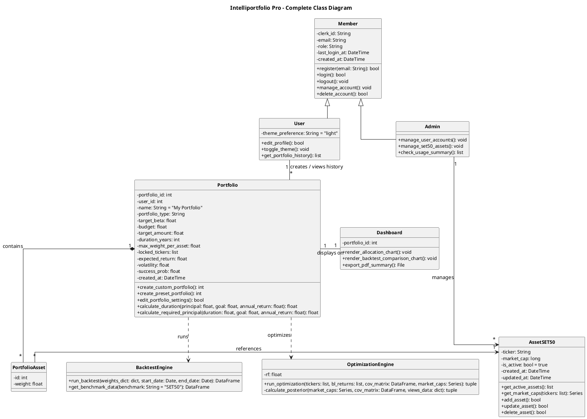

# PlantUML Class Diagram

Class Diagram ของระบบจัดพอร์ตการลงทุนอัจฉริยะ (Intelliportfolio Management System) อ้างอิงตามขอบข่ายโครงงาน (1.4) และ Use Case Description จัดเรียงสไตล์มินิมอล (Minimalist UML) ตามหลักสากล

---

## โครงสร้างคลาส (PlantUML)

---

## คำอธิบายสัญลักษณ์ความสัมพันธ์

| ความสัมพันธ์ | สัญลักษณ์ | ความหมาย |
| :--- | :--- | :--- |
| User/Admin △→ Member | ลูกศรสามเหลี่ยมโปร่งชี้ขึ้นหา Member (Superclass) | Generalization: User และ Admin สืบทอดคุณสมบัติการเข้าระบบจากคลาส Member |
| Admin → AssetSET50 | เส้นตรงลูกศรเปิด | Directed Association: แอดมินมีสิทธิ์จัดการข้อมูลหลักทรัพย์ SET50 |
| User — Portfolio | เส้นตรงธรรมดา (1 ต่อ *) | Association: ผู้ใช้สามารถสร้างและดึงประวัติพอร์ตของตนเองได้หลายพอร์ต |
| Portfolio — Dashboard | เส้นตรงธรรมดา (1 ต่อ 1) | Association: พอร์ตโฟลิโอแสดงผลบน Dashboard (และดาวน์โหลด PDF ที่นี่) |
| Portfolio ◆— PortfolioAsset | ข้าวหลามตัดทึบติดขอบด้านล่าง Portfolio (1 ต่อ *) | Composition: ถ้าลบพอร์ต สินทรัพย์จะถูกลบด้วย |
| PortfolioAsset → AssetSET50 | ลูกศรเปิดชี้ไปทางขวาหา AssetSET50 (* ต่อ 1) | Directed Association: อ้างอิงข้อมูลหุ้น |
| Portfolio ⇢ Engine | เส้นประลูกศรเปิดชี้ลง | Dependency: พอร์ตโฟลิโอมีการเรียกใช้งานคลาส Engine เพื่อประมวลผล |
