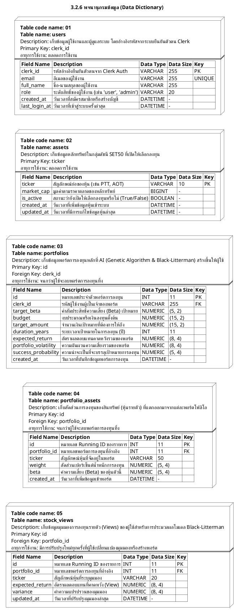

# PlantUML Data Dictionary

เอกสารนี้ใช้สำหรับสร้างภาพ Data Dictionary ในรูปแบบตารางกราฟิก

```plantuml
@startuml
skinparam defaultFontName "Sarabun"
skinparam monochrome true
skinparam shadowing false
skinparam nodesep 40
skinparam ranksep 40
skinparam nodeBackgroundColor white

title 3.2.6 พจนานุกรมข้อมูล (Data Dictionary)

node users [
**Table code name: 01**
**Table name: users**
Description: เก็บข้อมูลผู้ใช้งานและผู้ดูแลระบบ โดยอ้างอิงรหัสจากระบบยืนยันตัวตน Clerk
Primary Key: clerk_id
อายุการใช้งาน: ตลอดการใช้งาน
====
|= Field Name |= Description |= Data Type |= Data Size |= Key |
| clerk_id | รหัสอ้างอิงยืนยันตัวตนจาก Clerk Auth | VARCHAR | 255 | PK |
| email | อีเมลของผู้ใช้งาน | VARCHAR | 255 | UNIQUE |
| full_name | ชื่อ-นามสกุลของผู้ใช้งาน | VARCHAR | 255 | |
| role | ระดับสิทธิ์ของผู้ใช้งาน (เช่น 'user', 'admin') | VARCHAR | 20 | |
| created_at | วันเวลาที่สมัครสมาชิกหรือสร้างบัญชี | DATETIME | - | |
| last_login_at | วันเวลาที่เข้าสู่ระบบครั้งล่าสุด | DATETIME | - | |
]

node assets [
**Table code name: 02**
**Table name: assets**
Description: เก็บข้อมูลหลักทรัพย์ในกลุ่มดัชนี SET50 ที่เปิดให้เลือกลงทุน
Primary Key: ticker
อายุการใช้งาน: ตลอดการใช้งาน
====
|= Field Name |= Description |= Data Type |= Data Size |= Key |
| ticker | สัญลักษณ์ย่อของหุ้น (เช่น PTT, AOT) | VARCHAR | 10 | PK |
| market_cap | มูลค่าตามราคาตลาดของหลักทรัพย์ | BIGINT | - | |
| is_active | สถานะว่ายังเปิดให้เลือกลงทุนหรือไม่ (True/False) | BOOLEAN | - | |
| created_at | วันเวลาที่เพิ่มข้อมูลหุ้นเข้าระบบ | DATETIME | - | |
| updated_at | วันเวลาที่มีการแก้ไขข้อมูลหุ้นล่าสุด | DATETIME | - | |
]

node portfolios [
**Table code name: 03**
**Table name: portfolios**
Description: เก็บข้อมูลพอร์ตการลงทุนหลักที่ AI (Genetic Algorithm & Black-Litterman) สร้างขึ้นให้ผู้ใช้
Primary Key: id
Foreign Key: clerk_id
อายุการใช้งาน: จนกว่าผู้ใช้จะลบพอร์ตการลงทุนทิ้ง
====
|= Field Name |= Description |= Data Type |= Data Size |= Key |
| id | หมายเลขประจำตัวพอร์ตการลงทุน | INT | 11 | PK |
| clerk_id | รหัสผู้ใช้งานผู้เป็นเจ้าของพอร์ต | VARCHAR | 255 | FK |
| target_beta | ค่าสัมประสิทธิ์ความเสี่ยง (Beta) เป้าหมาย | NUMERIC | (5, 2) | |
| budget | งบประมาณหรือเงินลงทุนตั้งต้น | NUMERIC | (15, 2)| |
| target_amount | จำนวนเงินเป้าหมายที่ต้องการให้ถึง | NUMERIC | (15, 2)| |
| duration_years | ระยะเวลาเป้าหมายในการลงทุน (ปี) | INT | 11 | |
| expected_return | อัตราผลตอบแทนคาดหวังรวมของพอร์ต | NUMERIC | (8, 4) | |
| portfolio_volatility | ความผันผวนความเสี่ยงรวมของพอร์ต | NUMERIC | (8, 4) | |
| success_probability | ความน่าจะเป็นที่จะบรรลุเป้าหมายการลงทุน | NUMERIC | (5, 4) | |
| created_at | วันเวลาที่บันทึกข้อมูลพอร์ตการลงทุน | DATETIME | - | |
]

node portfolio_assets [
**Table code name: 04**
**Table name: portfolio_assets**
Description: เก็บสัดส่วนการลงทุนของสินทรัพย์ (หุ้นรายตัว) ที่แตกออกมาจากแต่ละพอร์ตโฟลิโอ
Primary Key: id
Foreign Key: portfolio_id
อายุการใช้งาน: จนกว่าผู้ใช้จะลบพอร์ตการลงทุนทิ้ง
====
|= Field Name |= Description |= Data Type |= Data Size |= Key |
| id | หมายเลข Running ID ของรายการ | INT | 11 | PK |
| portfolio_id | หมายเลขพอร์ตการลงทุนที่อ้างอิง | INT | 11 | FK |
| ticker | สัญลักษณ์หุ้นที่จัดอยู่ในพอร์ต | VARCHAR | 50 | |
| weight | สัดส่วนเปอร์เซ็นต์น้ำหนักการลงทุน | NUMERIC | (5, 4) | |
| beta | ค่าความเสี่ยง (Beta) ของหุ้นตัวนี้ | NUMERIC | (5, 4) | |
| created_at | วันเวลาที่เพิ่มข้อมูลเข้าพอร์ต | DATETIME | - | |
]

node stock_views [
**Table code name: 05**
**Table name: stock_views**
Description: เก็บข้อมูลมุมมองการลงทุนรายตัว (Views) ของผู้ใช้สำหรับการประมวลผลโมเดล Black-Litterman
Primary Key: id
Foreign Key: portfolio_id
อายุการใช้งาน: มีการปรับปรุงใหม่ทุกครั้งที่ผู้ใช้เปลี่ยนแปลงมุมมองหรือสร้างพอร์ต
====
|= Field Name |= Description |= Data Type |= Data Size |= Key |
| id | หมายเลข Running ID ของรายการ | INT | 11 | PK |
| portfolio_id | หมายเลขพอร์ตการลงทุนที่อ้างอิง | INT | 11 | FK |
| ticker | สัญลักษณ์หุ้นที่ระบุมุมมอง | VARCHAR | 20 | |
| expected_return | อัตราผลตอบแทนที่คาดหวัง (View) | NUMERIC | (8, 4) | |
| variance | ค่าความแปรปรวนของมุมมอง | NUMERIC | (8, 4) | |
| updated_at | วันเวลาที่ปรับปรุงมุมมองล่าสุด | DATETIME | - | |
]

users -[hidden]down- assets
assets -[hidden]down- portfolios
portfolios -[hidden]down- portfolio_assets
portfolio_assets -[hidden]down- stock_views

@enduml
```
