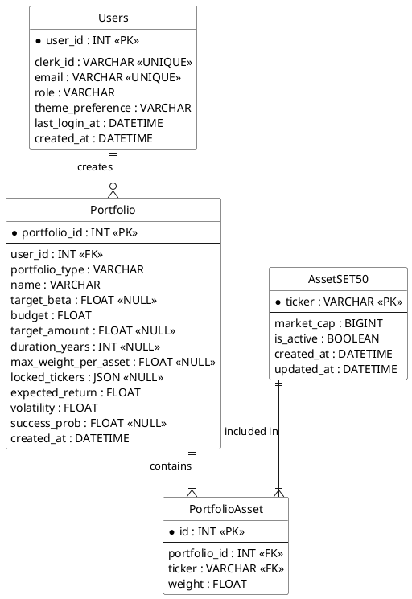

# Entity-Relationship Diagram (ERD)

เอกสารแสดงโครงสร้างฐานข้อมูล (Database Schema) ของระบบจัดพอร์ตการลงทุนอัจฉริยะ (Intelliportfolio) เขียนในรูปแบบ Crow's Foot Notation ตามมาตรฐาน UML และ Relational Database Design

---

## โครงสร้าง ER Diagram

---

## คำอธิบายตารางและฟิลด์ที่สำคัญ

1. **Users (ผู้ใช้และผู้ดูแลระบบ)**
   - `clerk_id`: รหัสอ้างอิงจาก Clerk
   - `role`: สถานะว่าเป็น 'USER' หรือ 'ADMIN'

2. **Portfolio (พอร์ตการลงทุน)**
   - `portfolio_type`: ประเภทพอร์ต เช่น `CUSTOM_ALL`, `FIND_BUDGET`, `PRESET_CONSERVATIVE` (นำไปคำนวณสรุปสถิติแอดมิน)
   - ฟิลด์อย่าง `target_beta`, `target_amount`, `duration_years`, `success_prob` จะมีค่าหรือเป็น NULL ขึ้นอยู่กับประเภทการจัดพอร์ต

3. **AssetSET50 (สินทรัพย์ใน SET50)**
   - `is_active`: แอดมินสามารถกำหนดให้หุ้นตัวไหนเปิด/ปิดการนำมาคำนวณได้

---

## 💡 ข้อเสนอแนะเพิ่มเติมสำหรับการสร้างฐานข้อมูลจริง (Physical Model / SQL DDL)

เพื่อป้องกันปัญหาข้อมูลขยะค้างในระบบ (Data Orphan) และทำให้ฐานข้อมูลมีความเสถียรสูงสุด ควรตั้งค่า **Deletion Behavior** (พฤติกรรมการลบข้อมูล) ของ Foreign Key ดังนี้:

1. **ตาราง `Portfolio` (ฟิลด์ `user_id`)**
   - ให้กำหนดเป็น `ON DELETE CASCADE`
   - **เหตุผล**: หากผู้ใช้ขอลบบัญชีออกจากระบบ (ผ่าน Webhook ของ Clerk) ข้อมูลพอร์ตทั้งหมดที่ผู้ใช้คนนั้นเคยสร้างไว้ จะถูกเคลียร์ทิ้งออกจากระบบโดยอัตโนมัติ

2. **ตาราง `PortfolioAsset` (ฟิลด์ `portfolio_id`)**
   - ให้กำหนดเป็น `ON DELETE CASCADE`
   - **เหตุผล**: หากผู้ใช้หรือระบบทำการลบพอร์ตการลงทุน (Portfolio) ข้อมูลสัดส่วนหุ้นย่อยๆ ที่ผูกอยู่กับพอร์ตนั้น (น้ำหนักหุ้นแต่ละตัว) จะถูกลบทิ้งตามไปด้วยทันที ไม่เหลือตกค้างเป็นขยะในฐานข้อมูล

### การจัดการข้อมูลซ้ำซ้อน (Data Integrity)

1. **ตาราง `PortfolioAsset` (Composite Unique Constraint)**
   - แนะนำให้ตั้งค่า Unique Constraint คู่กันระหว่างฟิลด์ `(portfolio_id, ticker)`
   - **เหตุผล**: เพื่อป้องกันปัญหาทาง Logic ไม่ให้ระบบเผลอบันทึกข้อมูลหุ้นตัวเดิมซ้ำซ้อนกันมากกว่า 1 บรรทัดภายในพอร์ตเดียวกัน (เช่น พอร์ต ID 1 จะมีหุ้น PTT ปรากฏได้แค่แถวเดียวเท่านั้น) เป็นการบังคับความถูกต้องระดับฐานข้อมูลครับ
