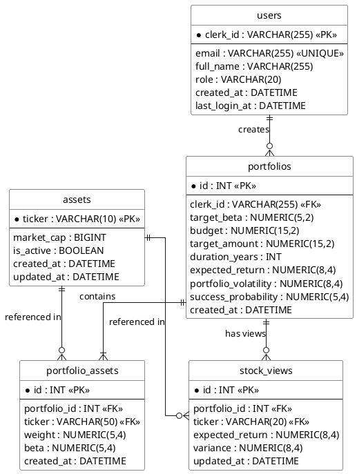

# Entity-Relationship Diagram (ERD)

เอกสารแสดงโครงสร้างฐานข้อมูล (Database Schema) ของระบบจัดพอร์ตการลงทุนอัจฉริยะ (Intelliportfolio) เขียนในรูปแบบ Crow's Foot Notation ตามมาตรฐาน UML และ Relational Database Design ฉบับสอดคล้องกับ Data Dictionary และโครงสร้างฐานข้อมูลจริง 100%

---

## โครงสร้าง ER Diagram (Crow's Foot Notation)

---

## คำอธิบายตารางและฟิลด์ที่สำคัญ

1. **users (ผู้ใช้งานและผู้ดูแลระบบ)**
   - `clerk_id`: รหัสอ้างอิงประจำตัวผู้ใช้งานจาก Clerk Authentication ทำหน้าที่เป็น Primary Key
   - `role`: ระดับสิทธิ์ของผู้ใช้งาน เช่น 'user', 'admin'

2. **assets (หลักทรัพย์ในกลุ่ม SET50)**
   - `ticker`: สัญลักษณ์ย่อของหุ้น (PK)
   - `is_active`: สถานะการเปิด/ปิดให้เลือกลงทุน

3. **portfolios (พอร์ตการลงทุนที่ AI สร้างขึ้น)**
   - `clerk_id`: Foreign Key เชื่อมไปยังตาราง `users`
   - `target_beta`, `expected_return`, `portfolio_volatility`, `success_probability`: ค่าสถิติและผลการคำนวณจาก Black-Litterman และ Genetic Algorithm

4. **portfolio_assets (สัดส่วนหุ้นในแต่ละพอร์ต)**
   - `portfolio_id`: Foreign Key เชื่อมไปยังตาราง `portfolios`
   - `weight`: สัดส่วนการกระจายน้ำหนักการลงทุน
   - `beta`: ค่าความเสี่ยงของหุ้นแต่ละตัว ณ เวลาที่จัดพอร์ต

5. **stock_views (มุมมองการลงทุน Black-Litterman)**
   - `portfolio_id`: Foreign Key เชื่อมไปยังตาราง `portfolios`
   - `expected_return` & `variance`: อัตราผลตอบแทนคาดหวังและความไม่แน่นอนของมุมมองผู้ลงทุน
