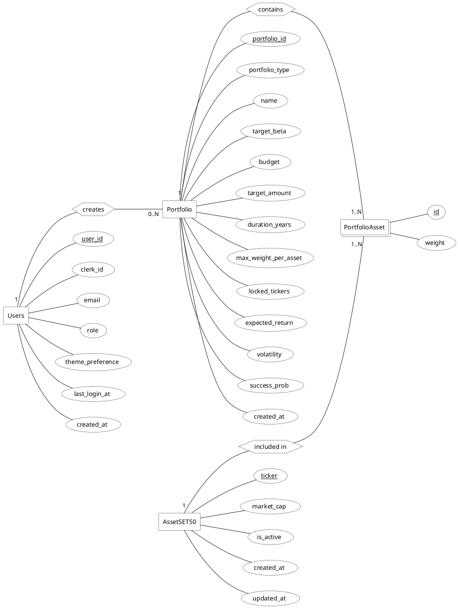

# PlantUML ER Diagram (Conceptual Design - Chen's Notation)

เอกสารนี้แสดง **Conceptual ER Diagram** (แบบ Chen's Notation) 

## Chen's Notation (`@startuml`)

```plantuml
@startuml
skinparam monochrome true
skinparam shadowing false
skinparam packageStyle rectangle

left to right direction

<style>
hexagon {
    BackgroundColor white
    .Identifying {
        LineThickness 2
    }
}
rectangle {
    BackgroundColor white
    .Weak {
        LineThickness 2
    }
}
collections {
    BackgroundColor white
}
usecase {
    BackgroundColor white
}
</style>

' ==========================================
' ENTITIES
' ==========================================
rectangle "Users" as Users
rectangle "Portfolio" as Portfolio
rectangle "AssetSET50" as AssetSET50
collections "PortfolioAsset" as PortfolioAsset

' ==========================================
' RELATIONSHIPS (Use 'usecase' for compatibility)
' ==========================================
hexagon "creates" as creates
hexagon "contains" as contains
hexagon "included in" as included_in

' ==========================================
' ATTRIBUTES: Users
' ==========================================
usecase "<u>user_id</u>" as user_id
usecase "clerk_id" as clerk_id
usecase "email" as email
usecase "role" as role
usecase "theme_preference" as theme_preference
usecase "last_login_at" as last_login_at
usecase "created_at" as created_at

Users -- user_id
Users -- clerk_id
Users -- email
Users -- role
Users -- theme_preference
Users -- last_login_at
Users -- created_at

' ==========================================
' ATTRIBUTES: Portfolio
' ==========================================
usecase "<u>portfolio_id</u>" as portfolio_id
usecase "portfolio_type" as portfolio_type
usecase "name" as name
usecase "target_beta" as target_beta
usecase "budget" as budget
usecase "target_amount" as target_amount
usecase "duration_years" as duration_years
usecase "max_weight_per_asset" as max_weight
usecase "locked_tickers" as locked_tickers
usecase "expected_return" as expected_return
usecase "volatility" as volatility
usecase "success_prob" as success_prob
usecase "created_at" as p_created_at

Portfolio -- portfolio_id
Portfolio -- portfolio_type
Portfolio -- name
Portfolio -- target_beta
Portfolio -- budget
Portfolio -- target_amount
Portfolio -- duration_years
Portfolio -- max_weight
Portfolio -- locked_tickers
Portfolio -- expected_return
Portfolio -- volatility
Portfolio -- success_prob
Portfolio -- p_created_at

' ==========================================
' ATTRIBUTES: AssetSET50
' ==========================================
usecase "<u>ticker</u>" as ticker
usecase "market_cap" as market_cap
usecase "is_active" as is_active
usecase "created_at" as a_created_at
usecase "updated_at" as a_updated_at

AssetSET50 -- ticker
AssetSET50 -- market_cap
AssetSET50 -- is_active
AssetSET50 -- a_created_at
AssetSET50 -- a_updated_at

' ==========================================
' ATTRIBUTES: PortfolioAsset (Junction Entity)
' ==========================================
usecase "<u>id</u>" as pa_id
usecase "weight" as weight

PortfolioAsset -- pa_id
PortfolioAsset -- weight

' ==========================================
' CONNECTIONS & CARDINALITY (Match with Crow's Foot)
' ==========================================
' Users ||--o{ Portfolio (1 to 0..N)
Users "1" -- creates
creates -- "0..N" Portfolio

' Portfolio ||--|{ PortfolioAsset (1 to 1..N)
Portfolio "1" -- contains
contains -- "1..N" PortfolioAsset

' AssetSET50 ||--|{ PortfolioAsset (1 to 1..N)
AssetSET50 "1" -- included_in
included_in -- "1..N" PortfolioAsset

@enduml
```
