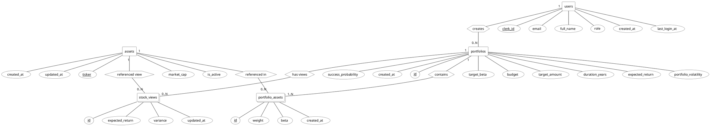

# PlantUML ER Diagram (Conceptual Design - Chen's Notation)

เอกสารนี้แสดง **Conceptual ER Diagram** (แบบ Chen's Notation) ตามโครงสร้างฐานข้อมูลล่าสุด

## Chen's Notation (`@startuml`)

```plantuml
@startuml
skinparam monochrome true
skinparam shadowing false
skinparam packageStyle rectangle

' left to right direction (Removed for better Smetana rendering)

<style>
hexagon {
    BackgroundColor white
    .Identifying {
        LineThickness 2
    }
}
rectangle {
    BackgroundColor white
    .Weak {
        LineThickness 2
    }
}
collections {
    BackgroundColor white
}
usecase {
    BackgroundColor white
}
</style>

' ==========================================
' ENTITIES
' ==========================================
rectangle "users" as Users
rectangle "portfolios" as Portfolio
rectangle "assets" as Assets
collections "portfolio_assets" as PortfolioAsset
collections "stock_views" as StockViews

' ==========================================
' RELATIONSHIPS
' ==========================================
hexagon "creates" as creates
hexagon "contains" as contains
hexagon "has views" as has_views
hexagon "referenced in" as ref_asset
hexagon "referenced view" as ref_view

' ==========================================
' ATTRIBUTES: users
' ==========================================
usecase "<u>clerk_id</u>" as u_clerk_id
usecase "email" as u_email
usecase "full_name" as u_full_name
usecase "role" as u_role
usecase "created_at" as u_created_at
usecase "last_login_at" as u_last_login_at

Users -- u_clerk_id
Users -- u_email
Users -- u_full_name
Users -- u_role
Users -- u_created_at
Users -- u_last_login_at

' ==========================================
' ATTRIBUTES: portfolios
' ==========================================
usecase "<u>id</u>" as p_id
usecase "target_beta" as p_target_beta
usecase "budget" as p_budget
usecase "target_amount" as p_target_amount
usecase "duration_years" as p_duration_years
usecase "expected_return" as p_expected_return
usecase "portfolio_volatility" as p_volatility
usecase "success_probability" as p_success_prob
usecase "created_at" as p_created_at

Portfolio -- p_id
Portfolio -- p_target_beta
Portfolio -- p_budget
Portfolio -- p_target_amount
Portfolio -- p_duration_years
Portfolio -- p_expected_return
Portfolio -- p_volatility
Portfolio -- p_success_prob
Portfolio -- p_created_at

' ==========================================
' ATTRIBUTES: assets
' ==========================================
usecase "<u>ticker</u>" as a_ticker
usecase "market_cap" as a_market_cap
usecase "is_active" as a_is_active
usecase "created_at" as a_created_at
usecase "updated_at" as a_updated_at

Assets -- a_ticker
Assets -- a_market_cap
Assets -- a_is_active
Assets -- a_created_at
Assets -- a_updated_at

' ==========================================
' ATTRIBUTES: portfolio_assets
' ==========================================
usecase "<u>id</u>" as pa_id
usecase "weight" as pa_weight
usecase "beta" as pa_beta
usecase "created_at" as pa_created_at

PortfolioAsset -- pa_id
PortfolioAsset -- pa_weight
PortfolioAsset -- pa_beta
PortfolioAsset -- pa_created_at

' ==========================================
' ATTRIBUTES: stock_views
' ==========================================
usecase "<u>id</u>" as sv_id
usecase "expected_return" as sv_exp_return
usecase "variance" as sv_variance
usecase "updated_at" as sv_updated_at

StockViews -- sv_id
StockViews -- sv_exp_return
StockViews -- sv_variance
StockViews -- sv_updated_at

' ==========================================
' CONNECTIONS & CARDINALITY
' ==========================================
' Users -- Portfolio (1 to 0..N)
Users "1" -- creates
creates -- "0..N" Portfolio

' Portfolio -- PortfolioAsset (1 to 1..N)
Portfolio "1" -- contains
contains -- "1..N" PortfolioAsset

' Portfolio -- StockViews (1 to 0..N)
Portfolio "1" -- has_views
has_views -- "0..N" StockViews

' Assets -- PortfolioAsset (1 to 0..N)
Assets "1" -- ref_asset
ref_asset -- "0..N" PortfolioAsset

' Assets -- StockViews (1 to 0..N)
Assets "1" -- ref_view
ref_view -- "0..N" StockViews

@enduml
```
