# PlantUML Sequence Diagrams (15 Use Cases Baseline)

เอกสารนี้รวบรวม **Sequence Diagrams** สำหรับทั้ง 15 Use Cases ของระบบ **"ระบบการจัดการพอร์ตการลงทุนอัจฉริยะ โดยใช้อัลกอริทึมเชิงพันธุกรรม"** 
ยึดโครงสร้างสอดคล้องกับ **Use Case Diagram (15 Use Cases)** 100%

---

## 1. การสมัครสมาชิก (Register)

---

## 2. การแก้ไขข้อมูลส่วนตัว (Edit Personal Profile)
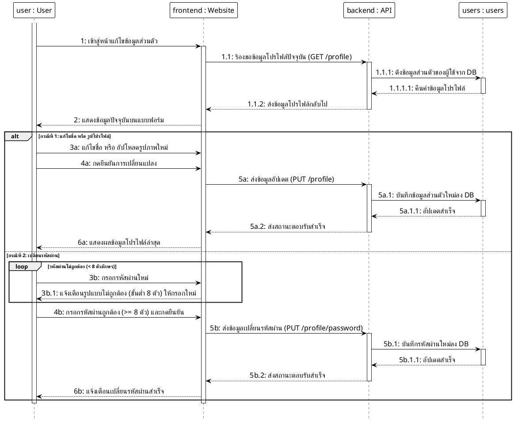

---

## 3. การกำหนดเป้าหมายการลงทุน (Set Investment Goals)
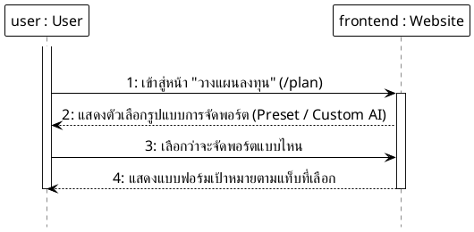

---

## 4. การเลือกตลาดและสินทรัพย์ที่ต้องการ (Select Markets & Assets)
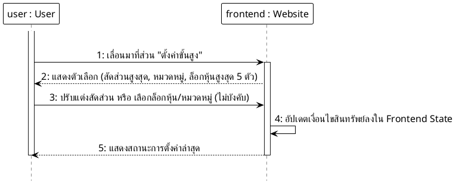

---

## 5. การสร้างพอร์ตการลงทุน (Create Investment Portfolio)
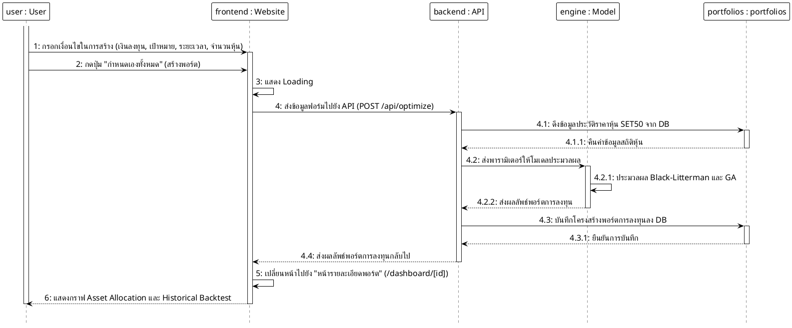

---

## 6. การสร้างพอร์ตแนะนำอัตโนมัติ (Create Automatic Recommended Portfolio)
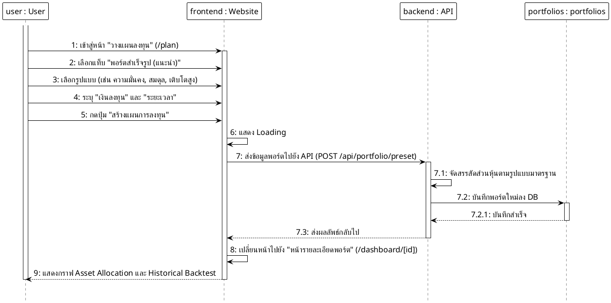

---

## 7. การแก้ไขตั้งค่าพอร์ตการลงทุน (Edit Portfolio Settings)
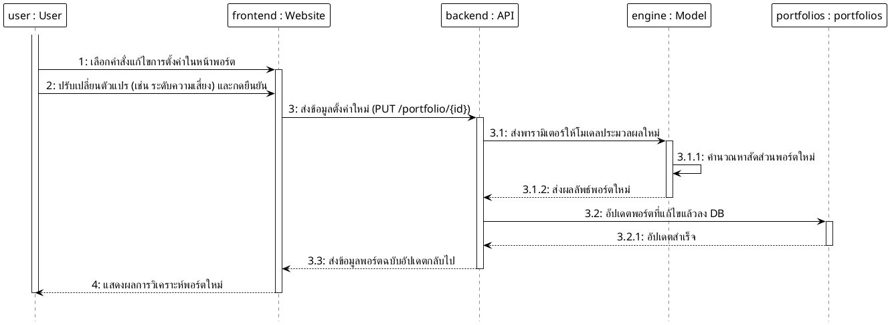

---

## 8. การดาวน์โหลดผลสรุปเป็นไฟล์ PDF (Download Summary Results as PDF)
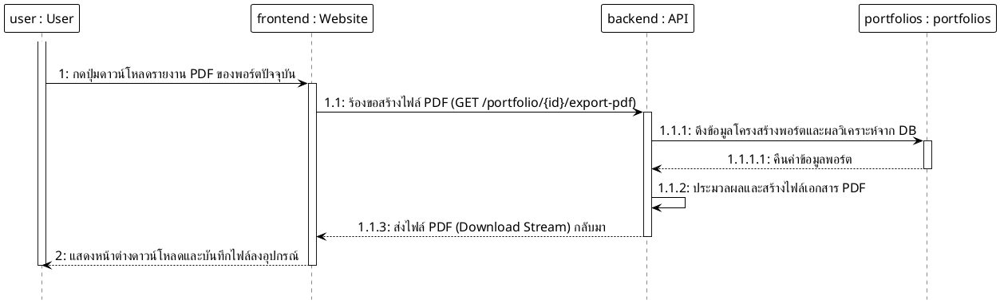

---

## 9. การดูประวัติผลการวิเคราะห์ (View Analysis History)
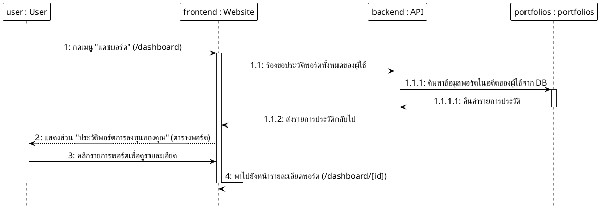

---

## 10. การปรับธีมสว่างและมืด (Toggle Light/Dark Theme)
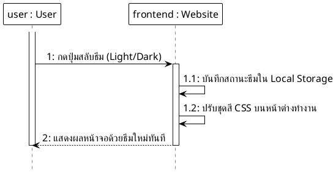

---

## 11. การเข้าสู่ระบบ (Log in)

---

## 12. การออกจากระบบ (Log out)
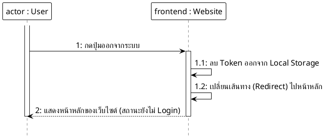

---

## 13. การจัดการแก้ไขข้อมูลบัญชีผู้ใช้ (Manage User Accounts - Admin)
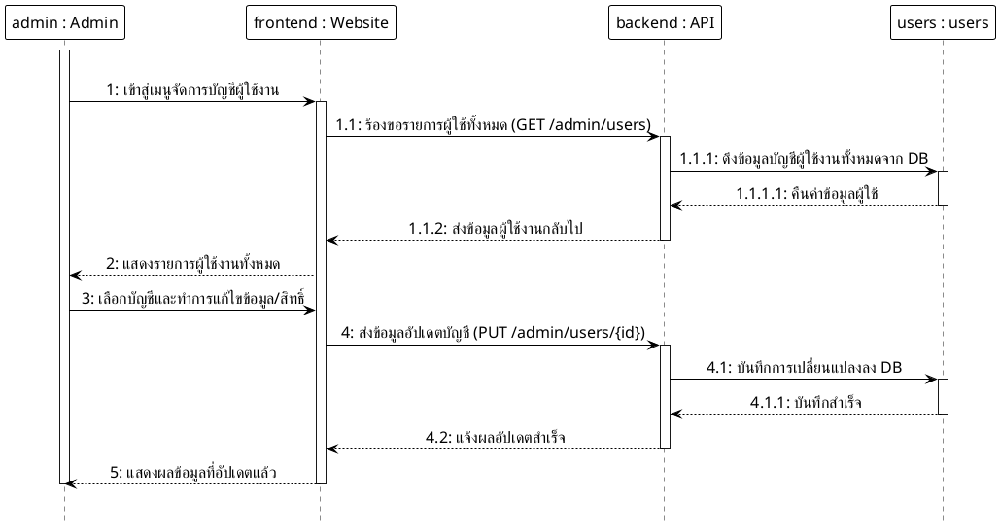

---

## 14. การตรวจสอบตารางสรุปผลการใช้งานของผู้ใช้ทั้งหมด (Check User Usage Summary Table - Admin)
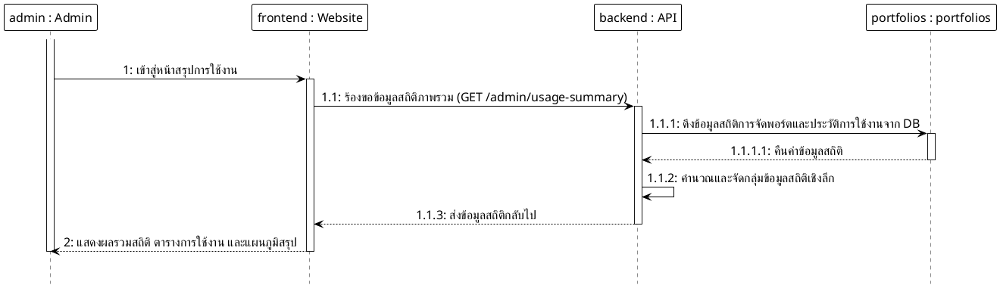

---

## 15. การจัดการสินทรัพย์ SET50 (Manage SET50 Assets - Admin)
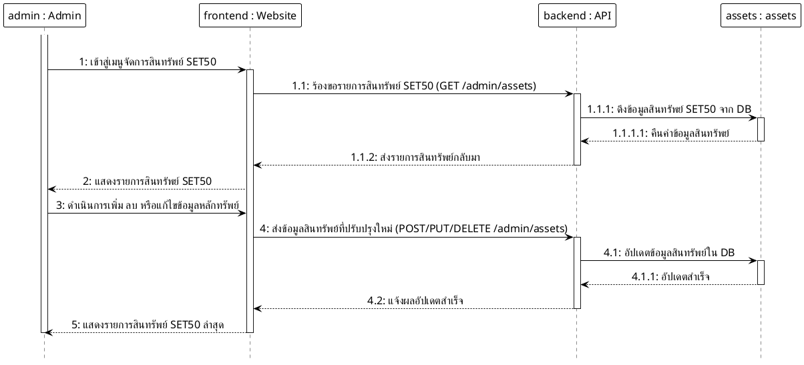
